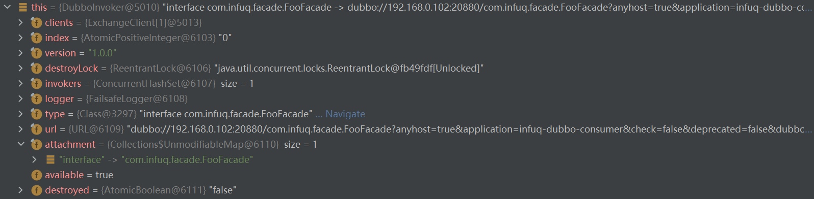

提供者端配置DubboProvider.xml
```xml
<dubbo:service ref="fooFacade" interface="com.infuq.facade.FooFacade" version="1.0.0"/>
<dubbo:service ref="barFacade" interface="com.infuq.facade.BarFacade" version="1.0.0"/>
```

消费者端错误配置DubboConsumer.xml
```xml
<dubbo:reference id="fooFacade" interface="com.infuq.facade.FooFacade" version="1.0.0" check="false" timeout="5000" retries="1" generic="true"/>
<dubbo:reference id="barFacade" interface="com.infuq.facade.BarFacade" version="1.0.0" check="false" timeout="5000" retries="1" generic="true"/>
```

测试代码
```java
import org.apache.dubbo.rpc.service.GenericService;
import org.springframework.context.ApplicationContext;
import org.springframework.context.support.ClassPathXmlApplicationContext;

public class DubboConsumer {

    public static void main(String[] args) throws Exception {

        ApplicationContext context = new ClassPathXmlApplicationContext("DubboConsumer.xml");

        // 泛化调用
        GenericService bean = context.getBean(GenericService.class);
        Object res = bean.$invoke("update", new String[] {"java.lang.String"}, new Object[] {"hangzhou"});
        System.out.println(res);

    }
}
```

报错如下
```text
Exception in thread "main" org.springframework.beans.factory.NoUniqueBeanDefinitionException: No qualifying bean of type 'org.apache.dubbo.rpc.service.GenericService' available: expected single matching bean but found 2: fooFacade,barFacade
	at org.springframework.beans.factory.support.DefaultListableBeanFactory.resolveNamedBean(DefaultListableBeanFactory.java:1271)
	at org.springframework.beans.factory.support.DefaultListableBeanFactory.resolveBean(DefaultListableBeanFactory.java:494)
	at org.springframework.beans.factory.support.DefaultListableBeanFactory.getBean(DefaultListableBeanFactory.java:349)
	at org.springframework.beans.factory.support.DefaultListableBeanFactory.getBean(DefaultListableBeanFactory.java:342)
	at org.springframework.context.support.AbstractApplicationContext.getBean(AbstractApplicationContext.java:1172)
	at com.infuq.consumer.DubboConsumer.main(DubboConsumer.java:16)
```

<font style="color:red">
No qualifying bean of type 'org.apache.dubbo.rpc.service.GenericService' available: expected single matching bean but found 2: 
fooFacade,barFacade</font>

<br>
<br>


修改消费者端配置DubboConsumer.xml
```xml
<dubbo:reference id="fooFacade" interface="com.infuq.facade.FooFacade" version="1.0.0" check="false" timeout="5000" retries="1" generic="true"/>
<dubbo:reference id="barFacade" interface="com.infuq.facade.BarFacade" version="1.0.0" check="false" timeout="5000" retries="1"/>
```

重新执行泛化调用, 得到泛化对象


根据以上分析, 采用 GenericService bean = context.getBean(GenericService.class) 方式进行泛化调用, 配置文件中只有一个bean才可以配置 generic="true".

如果其他bean也需要泛化调用, 可以采用如下方式

```java
import org.apache.dubbo.config.ApplicationConfig;
import org.apache.dubbo.config.ReferenceConfig;
import org.apache.dubbo.config.RegistryConfig;
import org.apache.dubbo.rpc.service.GenericService;

public class DubboConsumer {

    public static void main(String[] args) throws Exception {

        ReferenceConfig<GenericService> reference = new ReferenceConfig<GenericService>();
        reference.setApplication(new ApplicationConfig("infuq-dubbo-consumer"));
        reference.setRegistry(new RegistryConfig("zookeeper://zk.infuq.com:2181"));
        reference.setInterface("com.infuq.facade.FooFacade");
        reference.setVersion("1.0.0");
        reference.setGeneric("true");
        GenericService bean = reference.get();
        Object res = bean.$invoke("update", new String[] {"java.lang.String"}, new Object[] {"hangzhou"});
        System.out.println(res);

        reference = new ReferenceConfig<GenericService>();
        reference.setApplication(new ApplicationConfig("infuq-dubbo-consumer"));
        reference.setRegistry(new RegistryConfig("zookeeper://zk.infuq.com:2181"));
        reference.setInterface("com.infuq.facade.BarFacade");
        reference.setVersion("1.0.0");
        reference.setGeneric("true");

        bean = reference.get();
        res = bean.$invoke("query", new String[] {"java.lang.String"}, new Object[] {"chengdu"});
        System.out.println(res);

    }
}

```

> 每个需要泛化调用的bean必须各自创建ReferenceConfig实例


<br>

查看消费端泛化调用的DubboInvoker


查看消费端常规调用的DubboInvoker



不同点<br>
1.type值不同<br>
2.URL中的generic值不同, 泛化调用的URL中标识了generic=true

```text
// 泛化调用的URL
dubbo://192.168.0.102:20880/com.infuq.facade.FooFacade?anyhost=true&application=infuq-dubbo-consumer&check=false&deprecated=false&dubbo=2.0.2&dynamic=true&generic=true&interface=com.infuq.facade.FooFacade&metadata-type=remote&methods=query,queryPageInfo,update&pid=15052&register.ip=172.27.224.1&release=2.7.8&remote.application=infuq-dubbo-provider&revision=1.0.0&side=consumer&sticky=false&timestamp=1651231181767&version=1.0.0
// 常规调用的URL
dubbo://192.168.0.102:20880/com.infuq.facade.FooFacade?anyhost=true&application=infuq-dubbo-consumer&check=false&deprecated=false&dubbo=2.0.2&dynamic=true&generic=false&init=false&interface=com.infuq.facade.FooFacade&metadata-type=remote&methods=query,queryPageInfo,update&pid=14204&register.ip=172.27.224.1&release=2.7.8&remote.application=infuq-dubbo-provider&retries=1&revision=1.0.0&side=consumer&sticky=false&timeout=500000&timestamp=1651231181767&version=1.0.0

```


查看消费端泛化调用的invocation


查看消费端常规调用的invocation


不同点<br>
1.methodName和serviceName不同<br>
2.泛化调用的attachments中标识了generic=true
<br>


不管是泛化调用还是常规调用, invocation对象会被封装进Request, 将Request通过channel发送给提供者端.

```java
// org.apache.dubbo.remoting.exchange.support.header.HeaderExchangeChannel

@Override
public CompletableFuture<Object> request(Object request, int timeout, ExecutorService executor) throws RemotingException {
    if (closed) {
        throw new RemotingException(this.getLocalAddress(), null, "Failed to send request " + request + ", cause: The channel " + this + " is closed!");
    }

    Request req = new Request();
    req.setVersion(Version.getProtocolVersion());
    req.setTwoWay(true);
    // request = invocation
    req.setData(request);
    DefaultFuture future = DefaultFuture.newFuture(channel, req, timeout, executor);
    try {
        channel.send(req);
    } catch (RemotingException e) {
        future.cancel();
        throw e;
    }
    return future;
}

```


<br>
如果消费者端是泛化调用, 那么invocation的泛化信息由<font style="color:green">org.apache.dubbo.rpc.filter.GenericImplFilter#invoke</font>进行组装.

<br>


```java
@Override
public Result invoke(Invoker<?> invoker, Invocation invocation) throws RpcException {
    String generic = invoker.getUrl().getParameter(GENERIC_KEY);
    if (ProtocolUtils.isGeneric(generic)
            && (!$INVOKE.equals(invocation.getMethodName()) && !$INVOKE_ASYNC.equals(invocation.getMethodName()))
            && invocation instanceof RpcInvocation) {
        RpcInvocation invocation2 = new RpcInvocation(invocation);
        String methodName = invocation2.getMethodName();
        Class<?>[] parameterTypes = invocation2.getParameterTypes();
        Object[] arguments = invocation2.getArguments();

        String[] types = new String[parameterTypes.length];
        for (int i = 0; i < parameterTypes.length; i++) {
            types[i] = ReflectUtils.getName(parameterTypes[i]);
        }

        Object[] args;
        if (ProtocolUtils.isBeanGenericSerialization(generic)) {
            args = new Object[arguments.length];
            for (int i = 0; i < arguments.length; i++) {
                args[i] = JavaBeanSerializeUtil.serialize(arguments[i], JavaBeanAccessor.METHOD);
            }
        } else {
            args = PojoUtils.generalize(arguments);
        }

        if (RpcUtils.isReturnTypeFuture(invocation)) {
            invocation2.setMethodName($INVOKE_ASYNC);
        } else {
            invocation2.setMethodName($INVOKE);
        }
        invocation2.setParameterTypes(GENERIC_PARAMETER_TYPES);
        invocation2.setArguments(new Object[]{methodName, types, args});
        return invoker.invoke(invocation2);
    } else if ((invocation.getMethodName().equals($INVOKE) || invocation.getMethodName().equals($INVOKE_ASYNC))
            && invocation.getArguments() != null
            && invocation.getArguments().length == 3
            && ProtocolUtils.isGeneric(generic)) {

        Object[] args = (Object[]) invocation.getArguments()[2];
        if (ProtocolUtils.isJavaGenericSerialization(generic)) {

            for (Object arg : args) {
                if (!(byte[].class == arg.getClass())) {
                    error(generic, byte[].class.getName(), arg.getClass().getName());
                }
            }
        } else if (ProtocolUtils.isBeanGenericSerialization(generic)) {
            for (Object arg : args) {
                if (!(arg instanceof JavaBeanDescriptor)) {
                    error(generic, JavaBeanDescriptor.class.getName(), arg.getClass().getName());
                }
            }
        }

        invocation.setAttachment(
                GENERIC_KEY, invoker.getUrl().getParameter(GENERIC_KEY));
    }
    //
    return invoker.invoke(invocation);
}


```


